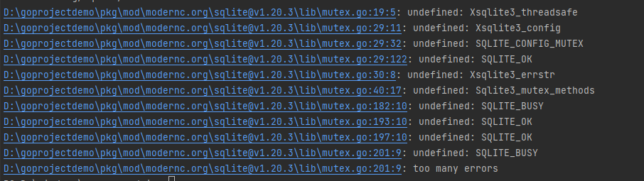

## 中间件casbin
```shell
go get github.com/casbin/gorm-adapter/v3
go get github.com/casbin/casbin/v2
```
其中进行go get github.com/casbin/gorm-adapter/v3 报错：


> 还是版本的问题，我们调整一下casbin的版本
```shell
	github.com/casbin/casbin/v2 v2.37.4
	github.com/casbin/gorm-adapter/v3 v3.10.0
```
注意： casbin在数据库中的数据，可以删除整条，但是不要将整条置为null
